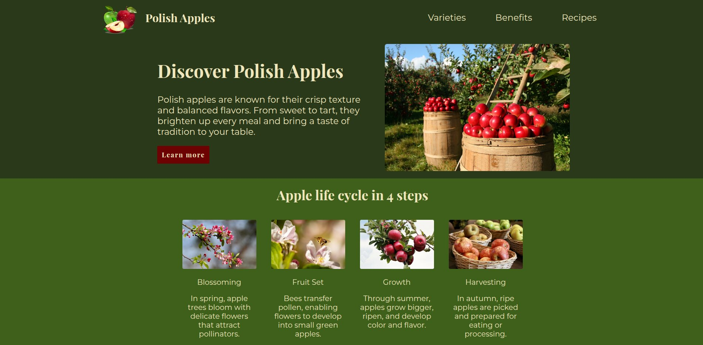

# The Odin Project: Lading page - Polish Apples
## Table of Contents

[Screenshot](#screenshots)
[About](#about)
[Technologies](#technologies)

# About 
This project is focused on learning and practicing CSS Flexbox. It includes various examples and exercises to help understand how Flexbox works for creating flexible and responsive layouts - SOON

# Technologies 
- HTML5
- CSS3